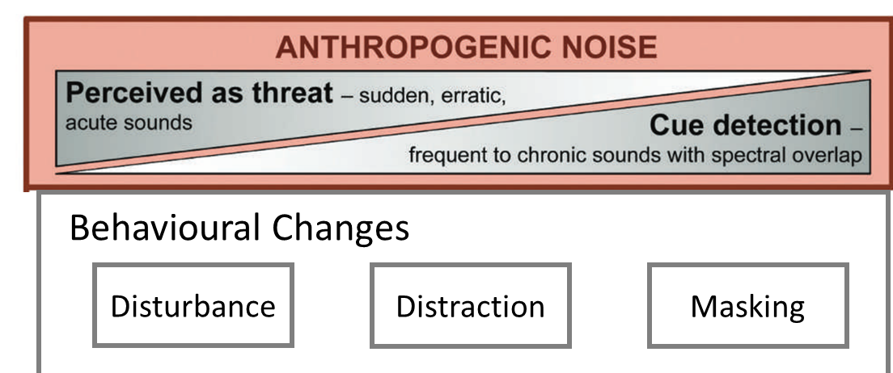
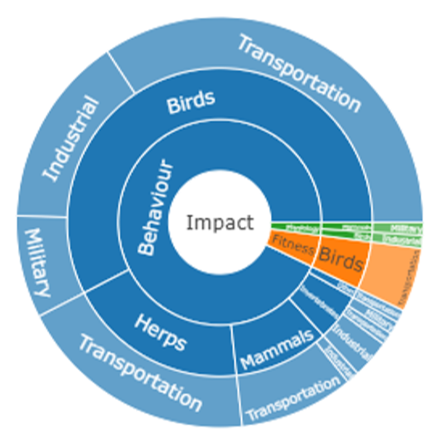
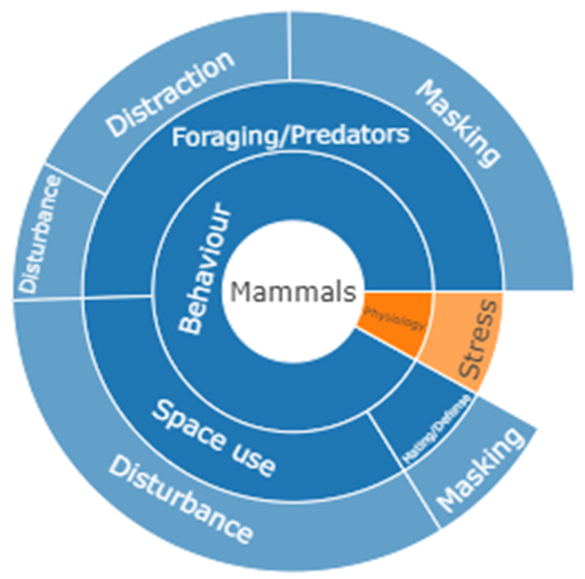

# A Systematic Review of Industrial Noise and Vibration Effects on Wildlife 

## Thresholds and Mitigation Strategies 

## Andrew D. Crosby | Erin M. Bayne | Cristabel Godoy 
### May 09, 2025  
 

## <a href="https://crosbya1.github.io/final-noise-review-presentation/">Presentation Link</a>
 

---

# Roadmap 

--

## 1. Project background 
--

## 2. Overview of sound

--

## 3. Summary of terrestrial noise effecs research

--

## 4. Thresholds and reccommendations

--

## 5. Summary of vibration research 

--

## 6. Research reccomendations

---

# The Growth of Noise in the Environment 

## **Noise:** *sound caused by human activity*

 

## We make a LOT of noise! 

 

## And it's EVERYWHERE 

---

# Effects of Noise on Wildlife 

## Extends beyond the physical footprint 
  - ### Road noise might be worse than roads 

  

## Found throughout otherwise intact ecosystems 

  

## Effects much different from natural sounds 

---
# Two Main Types of Effects 

.pull-left[
## Behavioural Effects

 - ### Movement patterns 
 
 - ### Communication strategies 
] 

.pull-right[
## Physiological Effects

  - ### Hearing loss
  - ### Increased stress hormones
] 

 

--
# Fitness Costs: **Changes in survival and reproduction** 

---

# Understanding Vulnerability to Noise

---

# Overview of Noise Effects 

## Most research focused on behaviour 

 

## **Three main behavioural pathways** 

--

* ## **Disturbance:** perceived as a threat

--

* ## **Distraction:** attention diverted

--

* ## **Masking:** covers important auditory cues

---
# Behavioural Effects of Noise Types

---
# Ultimate Effect of Noise 

---
# Types of Behavioural Effects 

## 1. Temporal patterns 

* ### Changes in timing of activity (Disturbance)

* ### Changes in timing of vocalization (Disturbance, Masking)

* ### Possible changes in sleep timing (little research) 

---
# Types of Behavioural Effects 

## 2. Space use 

* ### Deliberate avoidance of noisy areas 

  * ###  Noise perceived as a threat (Disturbance) 

  * ### Interference with cue detection (Masking) 

* ### Noise causes reduction in habitat quality 

## Redistribution can effect other species 

---
# Types of Behavioural Effects 

## 3. Foraging and anti-predator behaviour 

* ### Reduction in time spent foraging 

* ### Increased vigilance 

* ### Ability to detect prey animals 

## Cahnges in predator-prey dynamics 

---
# Types of Behavioural Effects 

## 4. Mate attraction and territory defense 

 ## Typically caused by masking effects 
 
 * ### Shifts in vocalization rate, volume, frequency complexity, etc... 
 
 * ### Consequence unclear 
 
 * ### Failure to find mates or detect intruders 
 
## Changes may be maladaptive 

---
# Physiological Effects 

## Mainly seen in stress response

  

## Direct hearing loss has been documented 

---
# Fitness Costs 

## Link between behavioural responses and populations 

  

## Cascading effects as distributions shift and populations change 

---
# Primary Questions of the Review 

## 1. What is the nature and direction of noise effects on wildlife? 

  

## 2. Are there noise thresholds at which effects become pronounced? 

  

## 3. Are there noise levels that should be avoided at certain times? 

---
# Components of the Review (PECO frameowrk)

## **Population:** Global terrestrial wildlife in non-urban environments 

  

## **Exposure:** Non-urban anthropogenic sound 

  

## **Comparator:** Conditions with and without noise 

  

## **Outcome:** Biological outcomes related to noise exposure 

---
# Overview of Sound

## **Sound:** *Vibration moving through a medium (air or water)*
.pull-left[
* ### Amplitude is the height of the wave
  * ### Measured in decibels (dB) 
  
* ### Frequency is number of waves per second
    * ### Measured in Hertz (Hz)
]

.pull-right[
  
]

---
# Adjusting dB for Hearing Capacity 

.pull-left[
* ## Z-weighting (Blue)
  * ### Unweighted decibels; (dB or dBZ)
  
* ## A-weighting (Yellow)
    * ### Normal human hearing (dBA) 

* ## C-weighting (Red)
    * ### Low frequencies (i.e., Industrial; dBC)
]

.pull-right[
  
]

---
# Sound Measurements 

## Sound Pressure Level (SPL) 
* ### Change in air pressure as sound wave moves through 

## Measuring sound through time 

### $L_{max}$: Maximum SPL over X time 

### $L_{min}$:Obvious

### $L_{eq}$: Logarithmic average of SPL over X time (equivalent sound level)

### $L_{X}$: SPL exceed X% of the time (exceedence percentile) 

---
# Summary of Search Results

.pull-left[
# 262 articles and 27 reviews 
* ## 60% Birds 
* ## 18% Herps 
* ## 17% Mammals 
* ## 5% Invertebrates
]

--

.pull-right[

* ## 63% Transportation 
* ## 19% Industrial 
* ## 13% Abstract 
* ## 3%  Military 
* ## 2% Other/undefined

]

---
# Summary of Search Results

---
# Summary of Search Results

.pull-left[
## Response Categories 

* ## 84% Behaviour 

* ## 10% Physiology 

* ## 6% Fitness
]

.pull-right[

]

---
# Summary of Effects on Birds 

.pull-left[
## Disturbance effects on space use 

* ## Avoidance of roads 

* ## Avoidance of industrial facilities 
]

.pull-right[

]

---
# Summary of Effects on Birds 

.pull-left[
## Masking effects on mating and territory defense

* ## Changes in song structure and timing  

* ## Inability to hear competing males  
]

.pull-right[

]

---
# Summary of Effects on Birds 

.pull-left[
## Masking effects on temporal patterns 

* ## Changes in song rates 

* ## Changes in singing times 
  * ### e.g., singing earlier in the day to avoid airplane noise (Gill et al. 2015 *in Beahvioral Ecology*)
]

.pull-right[

]

---
# Summary of Effects on Birds 
# **Birds found in Canada** 

## Bayne et al. 2008 *in Conservation Biology* 

* ## Songbird densities at noisy compressor stations and noiseless well pads

* ## 33% of specie showed negative noise response 

* ## Noise reduced habitat quality 

---
# Summary of Effects on Birds 
# **Birds found in Canada** 

## Sanchez et al. (2023) *in Ibis*
* ## Reduced singing rates and fewer song types of Lincoln's Sparrow at compressor stations 

## Kleist et al. (2016) *in Ecosphere*

* ## Reduced territory defense in Spotted Towhee and Chipping Sparrow 

---
# Summary of Effects on Mammals 

.pull-left[
## Almost entirely behaviour research 

## Two primary response types researched

  ## 1. Foraging and anti-predator behaviour 
  
  ## 2. Space use 
  
  ## Also mating and territory defense
]

.pull-right[

]

---
# Summary of Effects on Mammals 

.pull-left[
## Foraging and anti-predator behaviour

* ## Can follow all three pathways 
* ## Less time spent foraging 
* ## More time spent 'on alert' 

## Downstream effects on fitness 
]

.pull-right[

]

---
# Space use  

.pull-left[
## Typically through the disturbance pathway 

* ## Individuals avoid noisy areas 
* ## May relocate home ranges 

## Downstream effects on other areas and species
]

.pull-right[

]

---
# Masking 

.pull-left[
## Mainly in social animals that rely on auditory communication

* ## Masking of warning signals 

* ## Changes in rate and volume of vocalizations
]

.pull-right[

]

---
# Summary of Effects on Mammals 
# **Mammals found in Canada** 

## Kleist et al. (2021) *in Journal of Animal Ecology*

* ## Mule deer used areas with oil infrasturcture much more during production stage

* ## Drilling phase created much more noise 

* ## Stronly suggests noise is the primary factor 

---
# Summary of Effects on Mammals 

## Caribou response to low-level aircraft 
 * ## Caribou showed disturbance effects to aircraft (Maier et al. 1998 *in Journal of Wildlife Management*)

* ## Lower calf survival in caribou exposed to aircraft (Harrington and Veitch 1992 *in Arctic*)

---
# Summary of Effects on Herps 

---
# Summary of Effects on Invertebrates

---
# Thresholds in noise levels 

## **Ecological threshold:** a point at which a small change in an ecological driver results in a large response 

 

## Very few noise studies looked for thresholds 

 

## We looked a the minimum noise level at which a response was found 

---
# Threshold Plot

 

---
# Threshold table

 

---

# Reccomendations for Thresholds 

## Lack of research into thresholds 

## Two aspects we can think about 

* ## Timing of noise  

  

* ## Exposure to noise

---
# Timing of Noise

## Certain times of year make species more vulnerable 

## 1. Breeding season 

* ## Communication and parental care can be impaired

--- 

## 2. Late winter 

* ## Added stress from disturbance and increased vulnerability to predation

---
# Exposure and Ecological Context 

## **Exposure:** noise footprint + species hearing capability

  

## **Ecological Context:** 

* ## Species of concern 
* ## Time of year 
* ## Acoustic context (other noises) 

## Guidence from previouis table 

---
# Vibration Effects on Terrestrial Wildlife 

